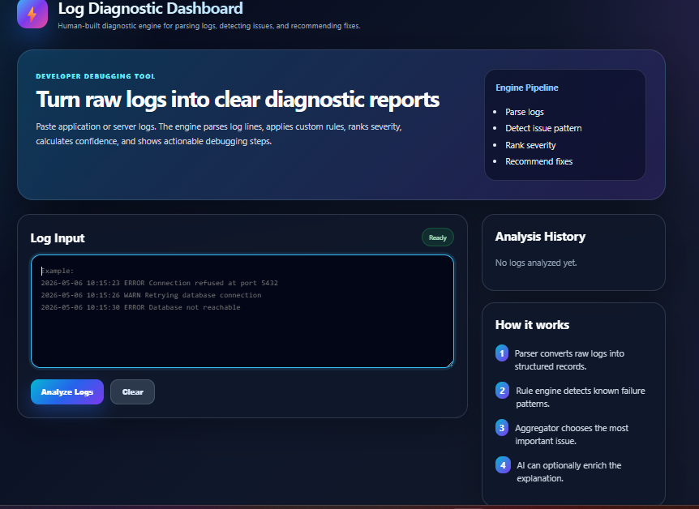
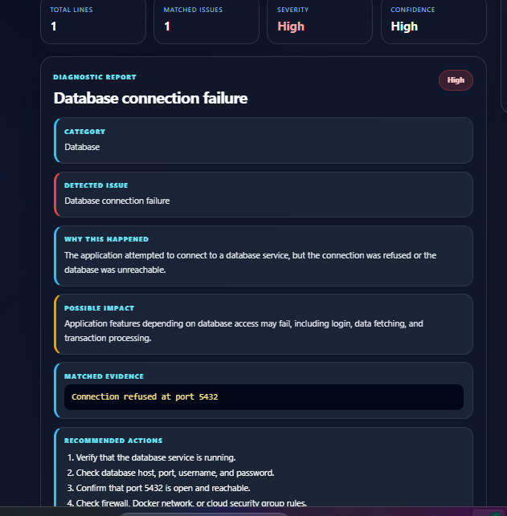
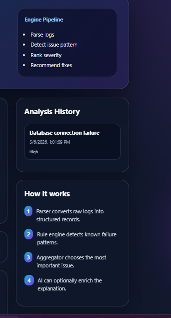

*# **Log Diagnostic Dashboard***


*A full-stack developer tool that analyzes raw application/server logs and generates a structured diagnostic report with detected issue, severity, confidence, matched evidence, possible impact, and recommended debugging actions.*


*This project is designed as a learning prototype for understanding log analysis, backend API design, frontend-backend integration, and modular diagnostic systems.*


*---*


***## Project Purpose***


*When applications fail, developers often need to read raw logs like:*


*```text*

*2026-05-06 10:15:23 ERROR Connection refused at port 5432*

***## Screenshots ***

### Dashboard home



### Diagnostic Report



### Analysis History

